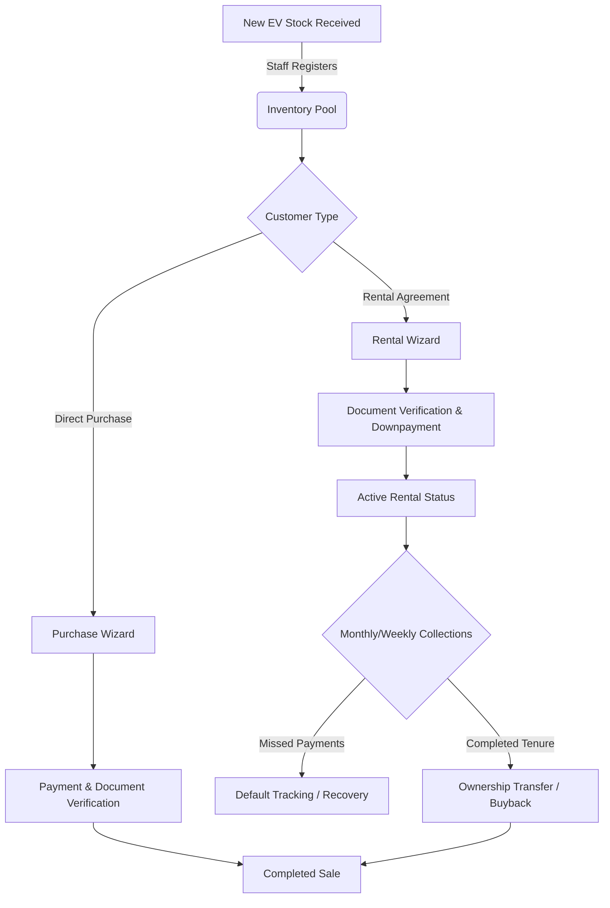

# 🛵 Go Speedy EV Finance Scheme

<div align="center">
  
  
  
</div>

<br />

**Go Speedy EV Finance Scheme** is a comprehensive, production-grade EV Rent & Purchase Management platform tailored for EV fleet operations in Delhi. It streamlines the entire lifecycle from inventory tracking to direct purchases, tenant management, and financial ledgers.

---

## 🌟 Overview & System Flow

The system seamlessly manages the EV operations loop:
1. **Supply & Inventory**: Wards supply EV scooties, and staff registers the inventory into the system.
2. **Onboarding**: Tenants apply for rentals (≤ 24 months) or direct purchases.
3. **Operations**: Real-time tracking of rentals, collections, maintenance (AMC), and insurance.
4. **Completion**: Automated conversion of completed rentals into permanent purchases (Buyback).

### 🔄 General User Flow



---

## 🚀 Core Features

- 📦 **Fleet & Inventory Management**: Monitor stock levels across wards in real-time, tracking in-stock, out-of-stock, and maintenance statuses.
- 🧙‍♂️ **Interactive Wizards**: Multi-step registration forms for seamless onboarding of tenants and direct purchasers.
- 💳 **Financial Ledger**: Track daily/weekly/monthly installments, downpayments, booking amounts, and AMC.
- 🛡️ **Insurance & Security**: Full tracking of vehicle and rider insurance (IDV, expiry), vehicle registration, chassis/motor uniqueness, and buyback structures.
- 🗄️ **Document Vault**: Secure uploads for KYC (Aadhar, PAN), Rent Agreements, AMC Documents, and Identity Photos.
- 🔐 **Advanced Authentication**: JWT-based auth with rotating refresh tokens, OAuth2 (Google Sign-In), and secure OTP password resets.
- 📜 **Audit Logging**: Comprehensive admin logs for all staff actions, ensuring operational transparency.

---

## 🏗️ Architecture & Tech Stack

This platform is structured as a robust **monorepo**, utilizing modern web technologies for high performance, security, and developer experience.

### Backend (`/backend`)
- **Runtime:** Node.js + Express.js (RESTful APIs)
- **Database:** Supabase (PostgreSQL) - Featuring 6 core tables with strict schema validations.
- **Storage:** Supabase Storage (Private buckets with short-lived signed URLs for top-tier document security).
- **Authentication:** Custom JWT Access tokens + bcrypt hashed Refresh Tokens + Google OAuth Integration.
- **Email Service:** Brevo SMTP for OTP and transactional emails.
- **Validation:** `zod` for strict request body parsing and sanitization.

### Frontend (`/frontend`)
- **Framework:** Next.js 14 (App Router)
- **State Management:** Zustand
- **Animations:** GSAP for smooth, dynamic user experiences.
- **Form Handling:** `react-hook-form` paired with `zod` for robust client-side validation.
- **Styling:** Tailwind CSS (or Custom CSS) with modular components.

---

## 📂 Project Structure

```text
/
├── backend/                # Express API Server
│   ├── src/
│   │   ├── api/            # Route controllers and endpoints
│   │   ├── config/         # Environment and DB config
│   │   ├── middleware/     # Auth, error handling, validation
│   │   ├── modules/        # Domain-driven feature modules (Inventory, Rentals, etc.)
│   │   ├── services/       # External services (Email, Supabase, OAuth)
│   │   └── utils/          # Helpers and constants
│   ├── db/                 # Database migrations or seeds
│   └── tests/              # API and unit tests
│
└── frontend/               # Next.js 14 Web Application
    ├── src/
    │   ├── app/            # Next.js App Router pages
    │   ├── components/     # Reusable UI components
    │   ├── store/          # Zustand state definitions
    │   ├── lib/            # Utilities and Axios clients
    │   └── hooks/          # Custom React hooks
    └── public/             # Static assets
```

---

## 🛠️ Quick Start & Setup Instructions

1. **Clone the repository:**
   ```bash
   git clone <repository-url>
   cd "Go Speedy Ev Finance Scheme"
   ```

2. **Setup Backend:**
   ```bash
   cd backend
   npm install
   cp .env.example .env  # Populate your Supabase, Google Auth, and Brevo keys
   npm run dev
   ```

3. **Setup Frontend:**
   ```bash
   cd ../frontend
   npm install
   cp .env.example .env.local # Point to backend API url
   npm run dev
   ```

4. **Access the application:**
   - Frontend: `http://localhost:3001` (or whichever port Next.js assigns)
   - Backend API: `http://localhost:5000`
   - Swagger Docs: `http://localhost:5000/api/docs`

---
*Built with ❤️ for efficient EV Operations.*